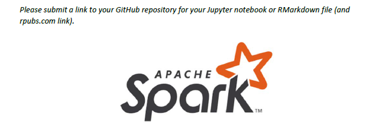

```{r setup, include=FALSE}
knitr::opts_chunk$set(echo = TRUE)
options(tinytex.verbose = TRUE)
```


```{r message=FALSE, warning=FALSE}
if (!require("knitr")) install.packages("knitr")
if (!require("tidyverse")) install.packages("tidyverse")
if (!require("kableExtra")) install.packages("kableExtra")
if (!require("dplyr")) install.packages("dplyr")
if (!require("ggrepel")) install.packages("ggrepel")
if (!require("recommenderlab")) install.packages("recommenderlab")
if (!require("tictoc")) install.packages("tictoc")
if (!require("sparklyr")) install.packages("sparklyr")

```

<p>&nbsp;</p>

## Objective 




<span style="font-size:16px;"></span>

## Data 

### Load your data into (for example)** 
<span style="font-size:16px;"> </span>
<span style="font-size:16px;"> I used MovieLens small datasets: 100,000 ratings and 3,600 tag applications applied to 9,000 movies by 600 users. </span>

```{r}
ratings_data <- read.csv('ratings.csv')
spark_data <- ratings_data
```

### Display your data
```{r echo=TRUE, paged.print=TRUE}
head(ratings_data) %>% kable()%>%
  kable_styling(bootstrap_options = "striped", full_width = F)
```

### Transform Data

I used `realRatingMatrix` from 'recommenderlab' to transform data.

```{r Transform Data}
ratings_data$userId <- as.factor(ratings_data$userId)

UI <- as(ratings_data, "realRatingMatrix")
dim(UI@data)

```

### Split training and test datasets.

Split the dataset into training set (80%) and testing set (20%).

```{r Split training}
set.seed(10)
train_set <- evaluationScheme(UI, method = "split", train = 0.8, given = 20, goodRating = 3)

#Train
train <- getData(train_set, "train")

#Known
known <- getData(train_set, "known")

#Unknown
unknown <- getData(train_set, "unknown")
```

## Centralized Recommender System - `recommenderlab`

I used `realRatingMatrix` from 'recommenderlab' to transform data.

```{r}
#dt1 <- data.table(ratings_data, key = "movieId") 
#dt2 <- data.table(movie_data, key = "movieId")

#ratings <- dt1[dt2]

# Training
tic('T-R')
Recommenderlab_CRS_Model <- Recommender(train, method = 'ALS')

t <- toc(quiet = TRUE)
train_time <- round(t$toc - t$tic, 3)

# Predicting

tic('P-R')

Recommenderlab_CRS_Predict<- predict(Recommenderlab_CRS_Model, newdata = known, 
                                     type="ratings")
t <- toc(quiet = TRUE)

predict_time <- round(t$toc - t$tic, 3)

(recclab_error <- calcPredictionAccuracy(Recommenderlab_CRS_Predict, unknown ))

```

## Distributed Recommender System - SparkR
```{r}
set.seed(10)

# connect to Spark locally
sc <- spark_connect(master = "local")

# Spark data processing

training_records <- sample(x = c(TRUE, FALSE), size = nrow(spark_data),replace = TRUE, prob = c(0.8, 0.2))

training <- spark_data[training_records, ]
testing <- spark_data[-training_records, ]

#  moving data frames to Spark
spark_training <- sdf_copy_to(sc, training, "train_ratings", overwrite = TRUE)
spark_testing <- sdf_copy_to(sc, testing, "test_ratings", overwrite = TRUE)

```
```{r}
tic('T-S')
sdf_als_model <- ml_als(spark_training, max_iter = 5, nonnegative = TRUE, rating_col = "rating", user_col = "userId", item_col = "movieId")

ts <- toc(quiet = TRUE)

trainingTime_spark <- round(ts$toc - ts$tic, 3)
# make prediction

tic('P-S')
prediction <- ml_transform(sdf_als_model, spark_testing) %>% collect()

ps <- toc(quiet = TRUE)

predictionTime_spark <-  round(ps$toc - ps$tic, 3)
# here are our top 10 movies we recommend for each user

```

```{r}

spark_mse <- mean((prediction$rating - prediction$prediction)^2)
spark_rmse <- sqrt(spark_mse)
spark_mae <- mean(abs(prediction$rating - prediction$prediction))


sparklyr_error <- c(
  "RMSE" = RMSE(prediction$rating, prediction$prediction),
  "MSE" = MSE(prediction$rating, prediction$prediction),
  "MAE" = MAE(prediction$rating, prediction$prediction))

comparison <- rbind(recclab_error, sparklyr_error)
rownames(comparison) <- c("Centralized System", "Distributed System")

kable(comparison) %>% kable_styling("striped", full_width = F)

```
```{r}

comparison1 <- cbind(train_time, predict_time)
comparison2 <- cbind(trainingTime_spark, predictionTime_spark)

comparison_time <- rbind(comparison1, comparison2)
rownames(comparison_time) <- c("Centralized System", "Distributed System")
colnames(comparison_time) <- c("train_time", "predict_time")

kable(comparison_time) %>% kable_styling("striped", full_width = F)
```


## Summary results.


