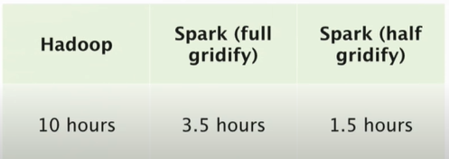

```{r setup, include=FALSE}
knitr::opts_chunk$set(echo = TRUE)
```

## Question: 

Please complete the research discussion assignment in a Jupyter or R Markdown notebook. You should post the GitHub link to your research in a new discussion thread.

For this discussion item, please watch the following talk and summarize what you found to be the most important or interesting points. The first half will cover some of the mathematical techniques covered in this unit's reading and the second half some of the data management challenges in an industrial-scale recommendation system.

Please make your post before our meetup on Thursday, and respond to at least one other student's posts by our meetup on Tuesday.

## Discussion:

<span style="font-size:16px;"> Chris Johnson explain a different concept very nicely and this video There are certain concepts which I found most interesting in the video.</span>

1. Manually tag attributes 
      + Pandora is doing with the music genome project. They have music experts who tag a song with 200 tags manually.

2. Collaborative Filtering 
      + Looking at what users are listeing to and analyzing that and finding relationships and recommending music based on that.

3. Implicit/Explicit Matrix Factorization

4. Audio Content, Metadata, Text Analysis

5.	Implicit Matrix Factorization with Hadoop

**Technique ** 

Running with larger datasetes often results in failed execution beacuse it required a lot of local memory. They are using Hadoop and spark solve the issue. Loading the ratings Matrix into bunch of blocks and grouping K x L partitions. He Partition with Block ID and cache into memory so the reduce time to read from disk from every iteration. It can be joining it to where the ratings are cached and keep performing the iterations.  It also reduces the memory requirements

 ** runtime ** 
 



